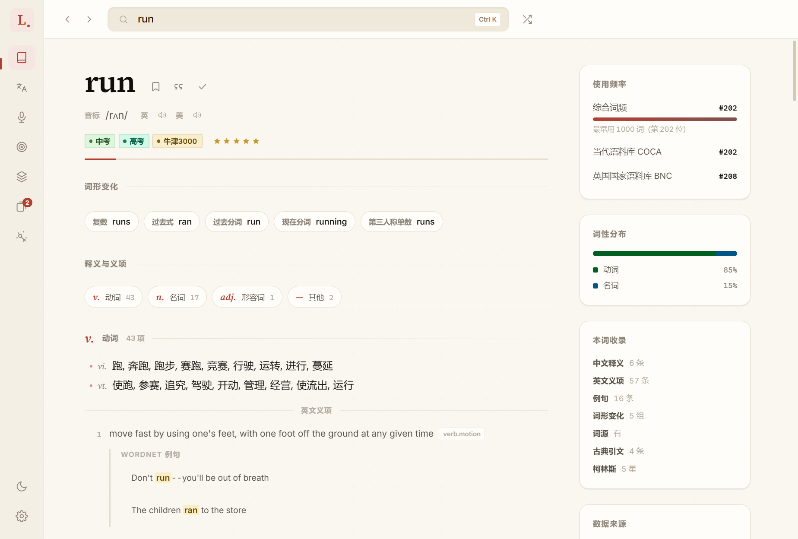
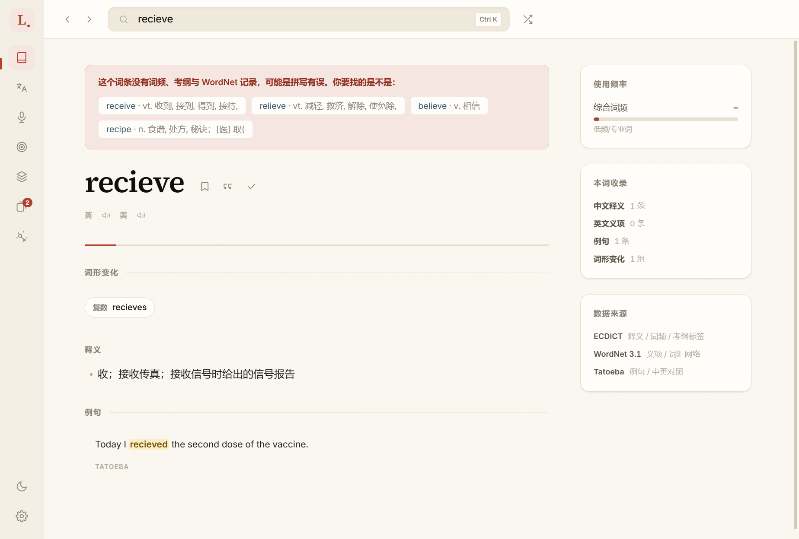
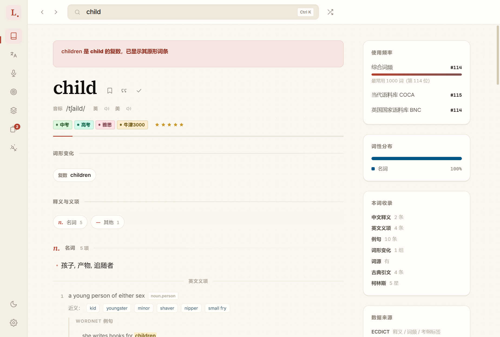
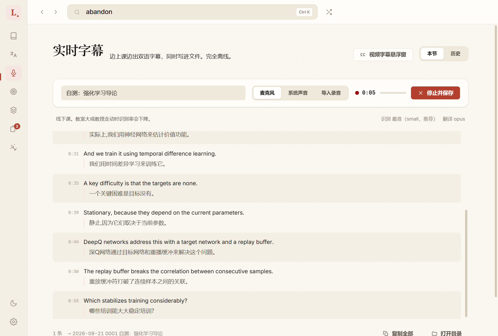
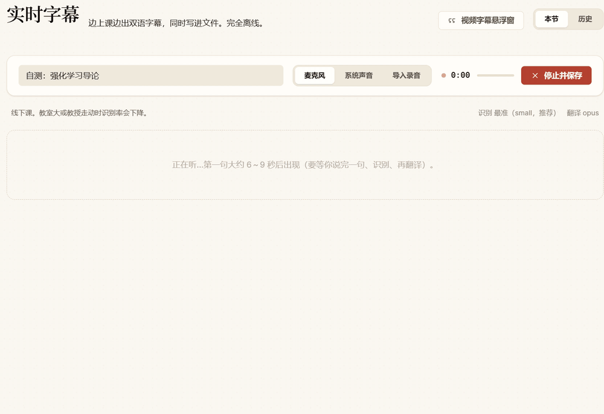

# Lexica

A 3.4-million-entry English–Chinese dictionary and a real-time lecture captioner that
both run with the network cable pulled out.

The interesting parts are the constraints. 1,260 MB of merged corpora searched through
SQLite FTS5, with a rule that demotes 3.24 M of the 3.40 M rows — everything carrying no
frequency rank, no Collins rating, no syllabus tag and no WordNet entry — below the 162 K
that keep at least one. Audio-processing throughput went from 0.58× to 4.0× real time on
my own hardware, by moving to a resident `whisper.cpp` server *and* bounding the encoder
context window against chunk length; the second change is the larger half. And both the Windows desktop app and the Android
build come from the same source tree, bridged by a minimal CommonJS runtime and a
`node:sqlite` shim over Kotlin.

*[中文说明见 README.zh-CN.md](README.zh-CN.md) — the app's own UI is Chinese; this file
is the engineering overview.*



## The dictionary

Five open sources — ECDICT, WordNet, Tatoeba, GCIDE and a Chinese Wikipedia page dump
— merged into one 1,260 MB SQLite file: 1.36 M single words and 2.04 M phrases, with
senses grouped by part of speech,
WordNet glosses and example sentences, inflections, frequency ranks from COCA and BNC,
and exam-syllabus tags from middle school through GRE.

**The weak-entry problem.** ECDICT includes a large number of misspellings and bare
inflected forms as first-class entries. Searching naively, a query for a common word
returns a page of near-identical junk. The fix is a rule, not a model: a row is marked
weak when it carries no authority signal at all — no frequency rank, no Collins rating,
no exam-syllabus tag, and no WordNet entry. That is exactly where ECDICT's
web-aggregated misspellings (`recieve`, `wierd`) and bare inflections (`ran`, `mice`)
land, and it demotes 3.24 M of the 3.40 M rows below the 162 K that keep at least one
signal, while leaving every one reachable by exact lookup — so a typo still resolves,
but ranks below the retained headwords instead of above them. Below *those*, which is
not the same as never outranking any real word: a real word no source rated is weak
too. The flag is the `weak` column in `words`; search ranking and the spell-correction
candidate pool both order on it rather than filtering, which is what keeps exact lookup
working.



`recieve` is a real ECDICT row, and the four signals are all absent — the panel on the
right reads 低频/专业词 with zero English senses. So it resolves, and it says why it is
unlikely to be what you meant.



`children` redirects to `child`, where every signal is present: rank #114 in the combined
frequency list, #115 in COCA, #114 in BNC, four syllabus tags, Collins 5. Same lookup
path, opposite side of the rule.

**No native modules.** SQLite is Node's built-in `node:sqlite`, not `better-sqlite3`.
FTS5, the trigram tokenizer and custom functions all work through it, which means the
app installs on a machine with no MSVC build tools — the reason for the choice in the
first place.

## Real-time captioning

Live bilingual subtitles for a lecture, taken from the microphone, from system audio, or
from an imported recording, written to a file as they go. Entirely offline.



The English line is what the system is judged on. The Chinese under it comes from a
118 MB local `opus-mt` model and is a rough gloss — good enough to follow along, wrong
often enough that the transcript keeps both languages rather than replacing one with the
other.

Getting it usable took three changes:

- **ONNX Whisper → a resident `whisper.cpp` server.** The ONNX path ran at 0.58× real
  time, i.e. falling behind a speaker permanently. Keeping a process warm and streaming
  chunks into it removes the per-chunk startup cost — necessary for real time, not
  sufficient on its own.
- **Bounding `--audio-ctx` against chunk length.** Shrinking the encoder context window
  is most of the speedup, but set it too small for a given chunk and the decoder
  degenerates into repeating the same phrase forever — with no error. The window is now
  derived from chunk length rather than fixed.
- **Beam search plus domain prompting**, for 0.8% WER — but see the conditions below
  before comparing that to anything.

**What those two numbers were measured on.** Neither is a benchmark result.

| | conditions |
|---|---|
| 0.58× → 4.00× | 5-second chunks, ONNX Whisper against a resident `whisper.cpp` server, my hardware |
| 0.8% WER | one 127-word lecture clip of my own, scored by `scratchpad/asr-quality.mjs`, `small` + beam-5 + domain prompt |

The shipped default is that last configuration, and it runs at **3.7×**, not 4.0× — beam
search and prompting buy accuracy with throughput. The 4.00× is what the runtime change
alone bought, on the faster settings. And throughput is not latency: 3.7× says audio is
processed faster than it arrives, not how far behind a caption appears. The full
per-configuration table, including the two settings that made WER *worse*, is in the
[Chinese README](README.zh-CN.md#识别质量三个可调项的实测).

Silence-based chunking (`src/main/vad-chunker.js`) splits on pauses rather than a fixed
clock, adapts its threshold to the room's noise floor, and keeps a lead-in so the first
syllable of a sentence is not clipped.

### Where the latency actually goes

Throughput said nothing about how far behind a caption appears, so I instrumented each
stage and read it off a 13-chunk run of the same clip:

| stage | measured | share |
|---|---|---|
| waiting for the speaker to pause (chunk length) | 3.2–7.7 s, median **4.8 s** | ~80% |
| queueing | 0 ms — nothing ever backed up | 0% |
| recognition (`small` + beam-5) | 750–1006 ms, median 920 ms | ~15% |
| translation (local `opus-mt`) | 134–987 ms, median **300 ms** | ~5% |

The thing that feels slow is the pause, not the models. Translation is 5% of it — which
is worth knowing before reaching for a faster translator, because a faster translator
cannot fix this.

So captions now go out twice. A second `whisper.cpp` server — smaller model, pinned to 4
threads — transcribes the *un-cut* buffer every 1.5 s and emits a provisional line
(212–352 ms per pass, and the accurate pass showed no measurable slowdown); the accurate
line replaces it when the speaker pauses. Provisional text is never written to the
transcript, which the self-test asserts by comparing the journal's segment count against
the finalised count.



The self-test, recorded. The italic line marked `···` is provisional — `Over many
episodes it learned.` — and a few frames later the accurate pass replaces it with the
whole sentence. It has no Chinese because provisional lines are only translated online,
which is off by default. The finished lines show the glossary at work: with eight terms
set up for this lecture they read 强化学习, 智能体观察了状态 and 经验回放缓冲, where the
same audio without a glossary came out as 加强学习, 特工观察了国家 and 重播缓冲. The two
lines it leaves wrong are recognition errors, upstream of where a glossary applies.

Synthetic speech, fed at 4× by the self-test and captured every 450 ms — so this shows
the pipeline, not real-time pacing. The latency table above is the measurement.

Two details that were not obvious. The cadence is driven by the audio callback rather
than a timer, because Chromium throttles timers in occluded windows and "occluded" is
exactly the case this feature exists for — a video player covering the app. And when
speech simply stops, no final line ever arrives to replace the provisional one, so the
capture side has to retract it explicitly; otherwise the last half-sentence sits on
screen indefinitely.

### From caption to dictionary

The two halves of the app used not to talk: a word you missed in a lecture had to be
written down and looked up later. Clicking an English word in a live caption, a past
transcript or the translation page now opens its entry in place, and one button adds it
to the word book together with the sentence it came from. The word under the cursor is
resolved with `caretRangeFromPoint` at click time rather than by wrapping every word in a
`<span>` — a lecture is thousands of words, and the row renderer had just been
consolidated after a hand-copied variant drifted. Past transcripts are searchable across
lectures; a hit opens an in-app transcript view scrolled to that line, where the same
click-to-look-up works. The self-test drives this with real mouse events
(`sendInputEvent`), since a synthetic `click()` carries no coordinates and would test
nothing.

### Optional online translation

Off by default; the offline claim above is the default configuration. The local model's
failure mode is not awkward phrasing, it is changed content — `71.2 to 63.8` came out as
`71.2 降低至 638`, `code and checkpoints` as `密码和检查站`, and `a scalar reward` lost the
term entirely. That is the reason the transcript keeps both languages. Routing through a
translation service fixes all four cases I checked.

Speed is roughly a wash, and swings with how warm the connection is. Measured inside the
app across three lecture runs: online 41–524 ms over 40 calls, median 99 ms; the local
model 72–1291 ms over 32 calls, median 162 ms. One call timed out and fell back, costing
2.3 s for that line. None of this matters much, because translation is 5% of the
latency — and the English line is emitted before translation is requested, so a slow or
failed translation delays only the Chinese.

It uses the endpoint the Google Translate web page uses: no key, but no SLA either, and
not covered by the terms of the paid API. So it is opt-in, every failure falls back to
the local model, the live-caption timeout is 1.2 s (a late caption is worth less than a
rough one), and three consecutive failures park it for a minute rather than paying a
timeout per sentence on a dropped connection. Provisional lines are translated at most
once every 2.5 s, because consecutive ones are lengthening prefixes that never hit the
cache and would otherwise spend the request budget on text that is about to be replaced.

One debugging note worth recording, because I got it wrong first. The integration
returned HTTP 429 consistently and I wrote that down as the endpoint rate-limiting me.
It was the request path: at the same moment, for the same URL, Electron's main-process
global `fetch` returned 429 while `net.fetch` and `node:https` both returned 200. The
client has to be handed `net.fetch` explicitly. The self-test now asserts on which
channel actually served the request rather than on the text, because a 429 falls back to
the local model silently and the local output happened to be right for the sentence I
was checking — the assertion passed while testing nothing.

Because the fallback is silent, the settings page shows the call, cache-hit and failure
counts — otherwise there is no way to tell which path a given caption came from.

## One source tree, two platforms

Not the same feature set on both, and the differences are deliberate:

| | Windows | Android |
|---|---|---|
| Dictionary search, entry view | ✓ | ✓ |
| Wordbook, notes, custom lists | ✓ | ✓ |
| Quiz / drill | ✓ | ✓ |
| Sentence translation (`opus-mt`) | ✓ | — |
| Live lecture captions | ✓ | — |
| Floating quick-lookup window | ✓ | — |

Translation is out on Android on purpose: the model is ~90 MB and WASM inference on a
phone is slow, so `mtStatus()` returns unavailable with a reason and phrases that miss
fall back to a word-by-word breakdown rather than an error. Captions are out because the
whole audio stack — capture worklet, source, subtitle window — is excluded from the
Android bundle; nothing about it was ported and nothing pretends to be.

The Android build reuses the desktop renderer verbatim. `npm run build:www` assembles
`android/app/src/main/assets/www` from `src/renderer`, and a test asserts the shared
files are **byte-identical** between the two — the copy cannot drift silently. What
differs is bridged:

- `cjs-runtime.js` — a minimal CommonJS loader, since the renderer is CJS and a WebView is not
- `android-sqlite.js` — a `node:sqlite`-shaped shim over a Kotlin `SqlBridge`
- Kotlin side: `AppBridge`, `SqlBridge`, `TtsBridge`

The bridge detail that cost the most time is in
[docs/android-port.md](docs/android-port.md): `SQLiteDatabase.execSQL()` refuses any
statement that returns rows, several PRAGMAs do so in their assignment form, and the
error message never mentions PRAGMA.

## Running it

Requires Node 22+ (for `node:sqlite`) and Windows for the desktop app.

```bash
npm install
npm run data              # ~800 MB of corpora → data/dict.db (1,260 MB)
npm start                 # dictionary only at this point
npm test                  # 188 tests, no data needed
```

The dictionary works after that. **Captioning and translation are separate downloads**,
and without them the lecture view has nothing to run:

```bash
npm run fetch:asr         # whisper.cpp runtime + base model, ~90 MB
npm run fetch:asr -- --all   # also the fast and high-accuracy models, ~330 MB
npm run fetch:model      # opus-mt-en-zh, 118 MB — for the translation pane
```

`npm run data` is a one-time cost, and after it — plus `npm install`, plus the captioning
assets below — lookup and captioning both run with no network at all. The
download script falls back through `gh-proxy.com` and `ghfast.top` before hitting
GitHub directly, which on a Chinese connection is the difference between minutes and
hours.

For Android: `npm run build:db:mobile` (a 383 MB slim database), then `npm run apk`.

## Layout

```
src/main/        electron main process — dict-db, asr, lecture, vad-chunker,
                 glossary, translate + translate-online, word-at,
                 transcript-search, quiz, user-db, selection (Windows UI Automation)
src/renderer/    the UI, shared verbatim with Android
scripts/         corpus download, database build, mobile slim build, APK build,
                 MT and ASR model evaluation harnesses
android/         Kotlin host + generated www assets
test/            210 tests across 42 suites, node:test, no network. 135 run on a
                 fresh clone; the other 75 need data/dict.db from npm run data
```

## Status

The desktop app is what I use daily. The Android build runs on a physical device — the
SQLite PRAGMA note linked above came out of its first launch on one.

The captioning numbers (0.58× → 4.0×, 0.8% WER) come from my own measurements on my own
hardware and lecture recordings, not from a public benchmark.

Dictionary data is redistributed under the licences of the upstream corpora; the
build scripts fetch them rather than vendoring them here.
